# Expense Tracker

A private, offline-first money tracker for Android and the web, designed to be used with one hand.
Track what you earn, spend and save. It knows *where* your savings came from, checks your card
statements against what you actually spent, follows a loan or a trip across months, keeps a
big event like a wedding or a new car on budget, keeps your important bills in folders, and tracks money you've borrowed from or lent to people.
Everything stays on your phone: no account, no server, no ads, no SMS permissions.

<p align="center">
  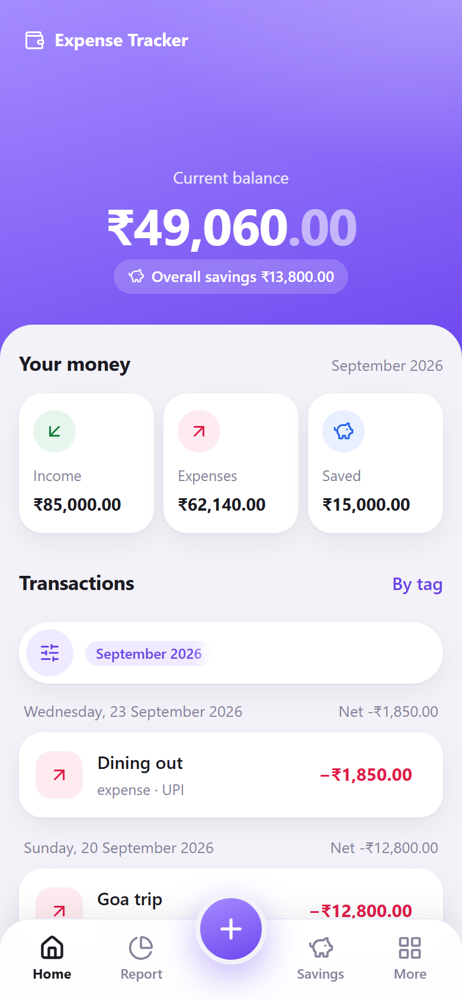
  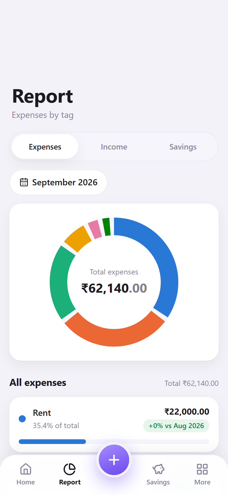
  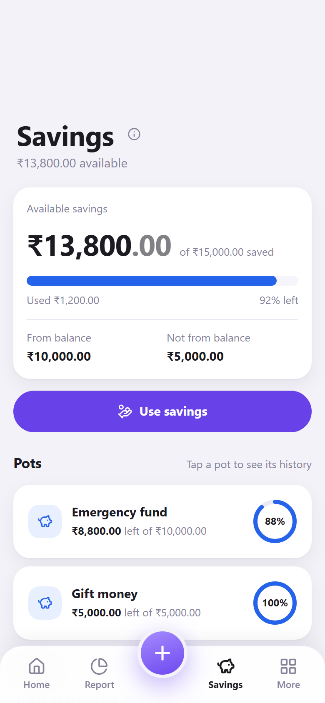
  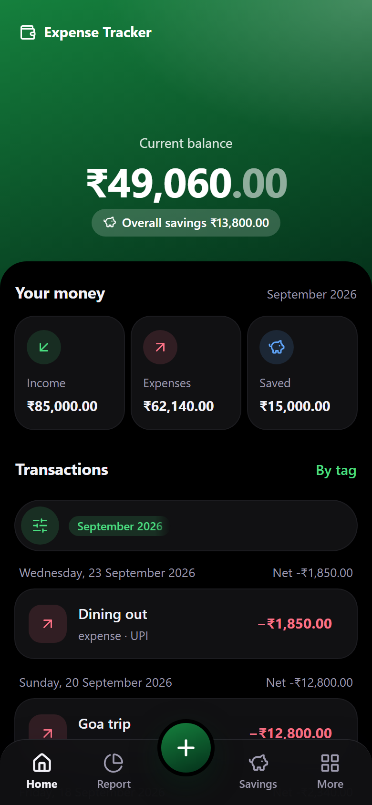
</p>

---

## Why this app exists

Most expense apps give you a single running total and nothing more. Real money is messier. This app was built to solve these problems:

| Problem | How the app solves it |
|---|---|
| **Not every saving comes from your salary.** Money you set aside from your pay and money family gives you get lumped together, and your "balance" goes wrong. | Each saving has a **"Deduct from current balance"** switch. Savings from your salary reduce your balance; money you were given doesn't. The balance stays honest and the savings total stays complete. |
| **You can't tell how much you saved from which source.** | Savings are grouped into **pots by tag** (e.g. "Salary savings", "Gift money"), each showing saved, used and remaining. |
| **Using savings muddles everything.** | **Use savings** takes money out of a specific pot. It lowers that pot, never your current balance, and can't take more than the pot holds. |
| **Credit card statements don't say what each charge was for.** | A separate **Credit cards** page where you log spends as you make them. At bill time, compare your logged total with the statement; the difference is what you missed or should question. Card spends never touch your balance, so nothing is counted twice. |
| **A loan or a trip is spread over many months.** | Use the same **tag** every time ("Car loan", "Goa trip"). The **Tags** page shows every tag across all months with totals, broken down month by month. |
| **Big events blow past the plan.** A wedding or a new car has many parts, and it's hard to see what's left overall and for each part. | **Budgets**: give an event a total, optionally split it into sub-budgets (Venue, Catering…), and note down each spend. Every spend comes off its sub-budget and the total, you see what's left at a glance, and going over is shown in red instead of blocked. Budgets are a plan, so they never touch your balance. |
| **Bills get lost when you need them.** The fridge breaks and the invoice is somewhere in a drawer or a chat. | **Bills**: photos and PDFs of bills, warranties and receipts, kept at original quality in folders you name (Warranties, Electricity, Car…). Each file is its own bill (pages can be added to keep a multi-page bill together), you can search by name, and open or share it straight from the app. Stored on the phone and included in backups. |
| **"Who owes whom" lives in your head.** You borrowed ₹50K from a friend, lent ₹20K to a cousin, and they're paid back in parts over months. | **Borrowed & lent**: one entry per borrowing or lending (who, how much, when, why, phone). Add each part as it's paid back and see what's left; it's marked Completed when fully paid. Call or WhatsApp the person from the entry. Separate from your balance. |
| **Your data is stuck on one phone.** | **Backup & restore** exports everything to one file you can keep on Drive. Import it on a new phone or reinstall. Older backups keep working as the app gains features. |
| **Finance apps want your SMS, a login and your data on their servers.** | Fully offline. Data lives in the phone's local database (IndexedDB) and nothing is sent anywhere. |
| **Apps built for two thumbs on a tablet.** | A **One UI-style, one-handed layout**: read-only information at the top, and everything you tap (tabs, the + button, forms, filters) within thumb reach at the bottom. |

---

## Features

### Everyday tracking
- **Add, edit and delete transactions** from a bottom sheet: amount, type, tag, date, note, payment method and payment source. Recent tags appear as one-tap chips.
- **Three kinds of transaction:** earning, expense and saving. You can create your own types on top (e.g. "Bonus" → earning, "SIP" → saving).
- **Home:** current balance, overall savings, and Income / Expenses / Saved cards for the selected period, followed by transactions grouped by day with a daily net.
- **Filters:** any combination of years × months, one transaction type at a time, tags, and for savings, **From balance / Not from balance**.

### Savings
- **"Deduct from current balance" switch** on every saving.
- **Savings page:** available savings, used vs saved progress, the from-balance / not-from-balance split, and **pots per tag** with progress rings.
- **Use savings:** withdraw from a chosen pot, capped at what it holds; shown in a combined saved/used history you can filter by pot.
- **Guard rails:** you can't edit or delete a saving if money already used from its pot would push that pot below zero.

### Insights
- **Report:** a donut chart and per-tag breakdown for Expenses, Income or Savings, with each tag's share and **% change vs the previous month**.
- **Tags page:** every tag across all time, grouped **Expenses → Savings → Income**, with count, date range and total. Tap a tag to see its transactions month by month (useful for EMIs, trips and subscriptions). Includes search and a period picker.

### Credit cards
- Add cards (name + last 4 digits), log spends per card, and see the total for any period.
- **Monthly utilization** chart and table for the last 6 months, per card.
- Kept separate from your balance by design, so you can reconcile statements without double-counting.

### Budgets for events
- **Plan any event** (a wedding, a function, a new car): give it a name and a total budget, then note down what you spend on it.
- **Optional sub-budgets:** split the total into parts (e.g. Car ₹10L → Purchase ₹5L, Modifications ₹3L, Repair ₹1L). The rest shows as **Unallocated**, and a warning appears if the parts add up to more than the total.
- **Spend from a sub-budget or the whole budget:** either way it comes off the total. Tap a sub-budget to see only its spends; tap a spend to edit, move or delete it.
- **Overspending is allowed** and shown in red, so the numbers always match reality.
- **Mark as done** moves a finished event out of the way (you can reopen it). Budgets are a plan only: they never change your balance.
- **Delete** a whole budget, a sub-budget (tap it, then Delete) or a single spend (🗑 on its row). Each asks first and says what goes with it.

### Bills
- **Keep important bills** as photos or PDFs, sorted into **folders** you create (one level: a folder holds any number of bills).
- **Add bills** by taking a photo or choosing several files at once: each file becomes its own bill, named after the file (rename any before saving). To keep a multi-page bill together, open it and use **Add pages**. Files are kept at their original size and nothing inside them is read.
- **View and share:** photos show in the app; tap a photo or **Open** a PDF to view it in your phone's own viewer (to zoom), or **Share** the whole bill to Drive, WhatsApp or email.
- **Organise:** rename or move a bill to another folder, add or delete pages, rename folders, delete a bill or a whole folder, and **search** bills across all folders.
- **Backed up:** bill files are included in the backup file, so they move with you to a new phone.

### Borrowed & lent
- **Two tabs:** **Borrowed** (money you owe people) and **Lent** (money people owe you), each with the total still outstanding.
- **One entry per borrowing or lending:** person, amount, date, and optionally why and their phone number. Tap it to expand the details and every payment.
- **Pay back in parts:** add each repayment (Borrowed) or amount received (Lent) with its date, pre-filled with what's left. A payment can't be more than what's left, and the amount can't be edited below what's already been paid.
- **Completed:** fully paid entries move to a collapsed Completed section automatically. **Mark as completed** closes one early (e.g. you let the rest go), and **Reopen** undoes it.
- **Delete** an entry (with its payments) or a single payment (🗑 on its row); each asks first.
- **Call or WhatsApp** the person straight from the entry. Kept separate from your balance, so nothing is counted twice.

### Make it yours
- **Themes:** background **System / Light / Dark / Black (AMOLED)** × accent **Purple / Blue / Green / Teal / Orange / Pink**. All combinations meet WCAG AA text contrast.
- **Manage options:** add or remove transaction types, payment methods and payment sources.
- **Info buttons (ⓘ)** explain the less obvious features (balance deduction, savings, credit cards, tags, budgets and sub-budgets, bills, borrowed & lent, backups) right where you use them.

### Your data
- **Backup & restore:** export everything (data, bill files and theme) to a JSON file. Large backups are written in pieces so they don't run the phone out of memory. On Android this opens the share sheet (save to Drive/Files, or send it to yourself); on the web it downloads.
- **Safe import:** the whole file is checked before anything changes; you see a summary, your data is replaced in a single step (all or nothing), and backups from older app versions are upgraded automatically.
- **Offline and private:** no network calls during normal use and no account.

### Android app
- A real installable `.apk` (Capacitor), with the Android back button going up one level at a time (it closes an open sheet first, and only leaves the app from Home).
- Built for Android 15's edge-to-edge screens: content is kept clear of the status bar, the gesture bar and the keyboard, and the bars take on your theme's colours.

<p align="center">
  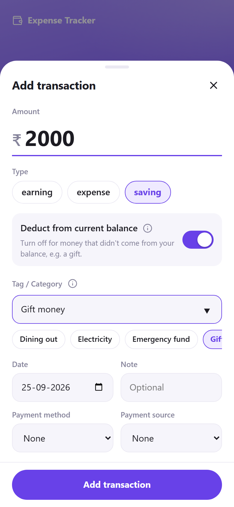
  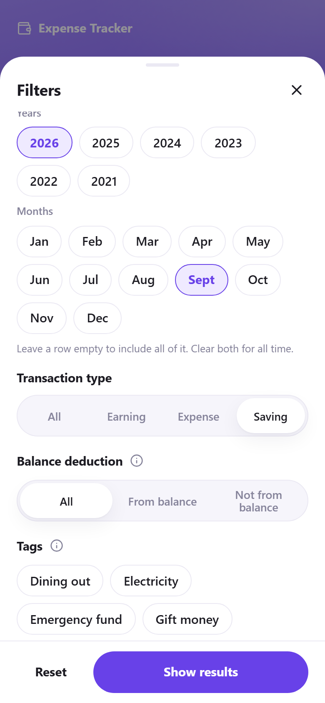
  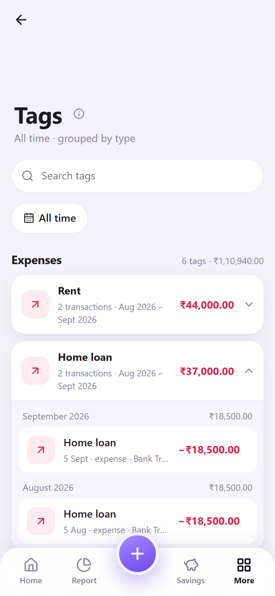
  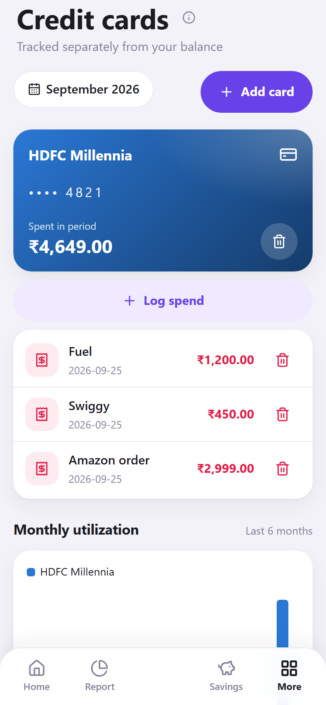
</p>
<p align="center">
  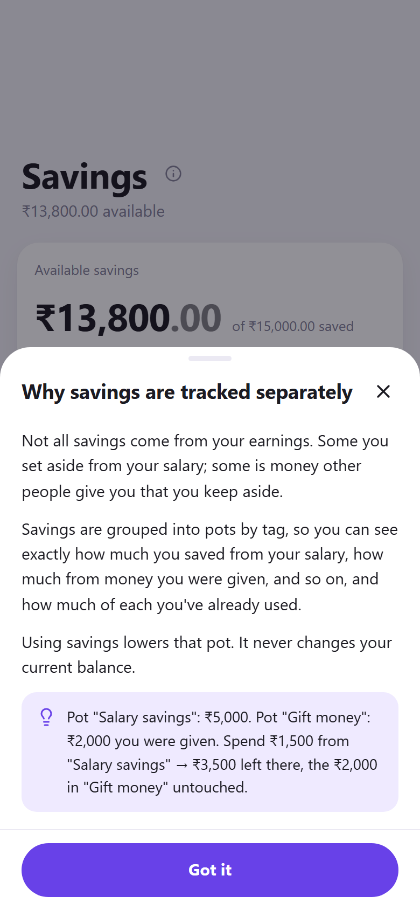
  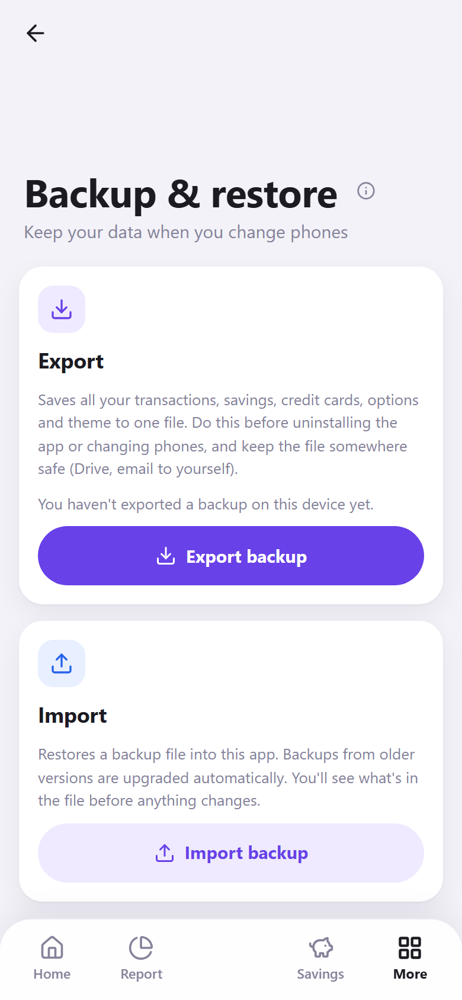
  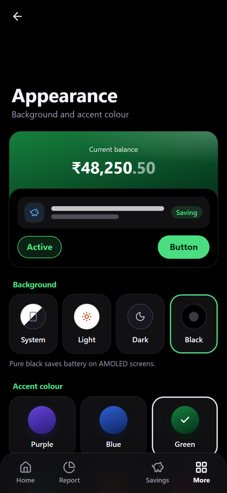
  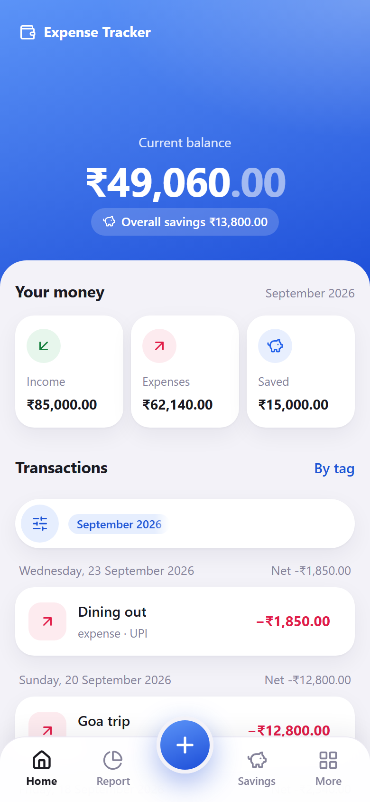
</p>
<p align="center">
  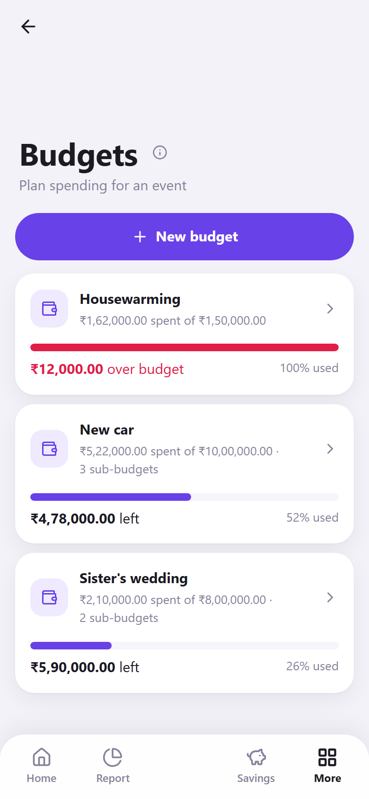
  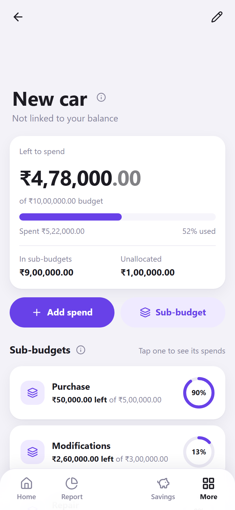
  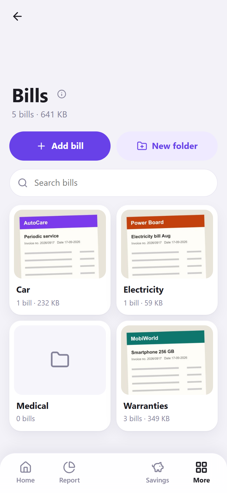
  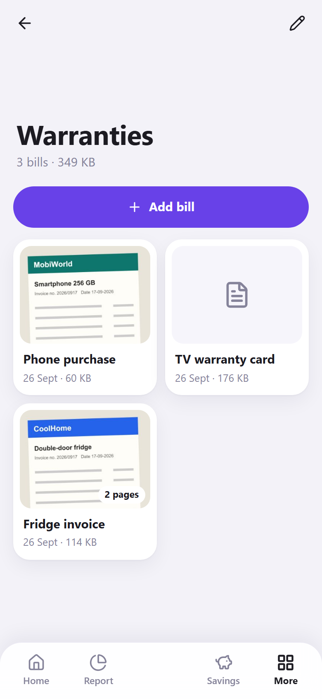
  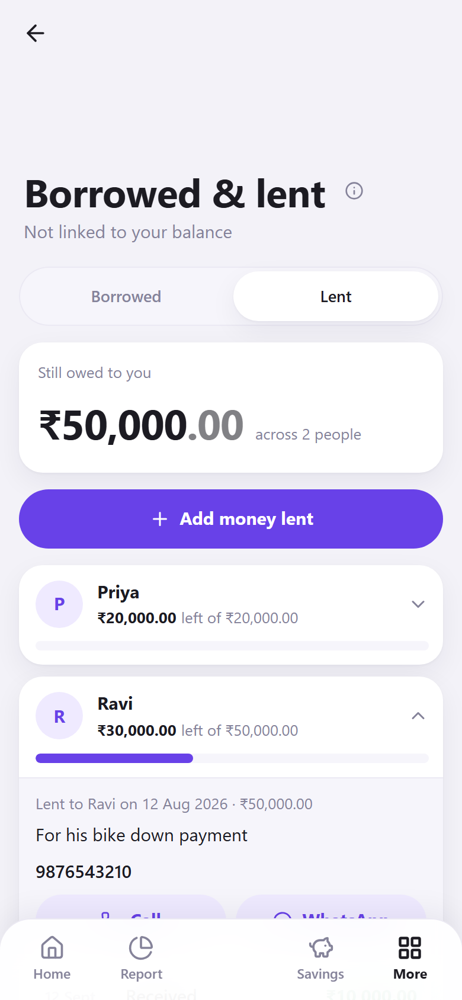
</p>

---

## How the numbers work

| Figure | Formula |
|---|---|
| **Current balance** (all time) | earnings − expenses − savings *deducted from balance* |
| **Overall savings** (all time) | all savings − savings used |
| **Pot remaining** (per tag) | saved into the pot − used from the pot (never below zero) |
| **Income / Expenses / Saved cards** | totals for whatever the Home filters currently show |
| **Credit card totals** | card spends only; never part of the balance |
| **Budget left** (per event) | total budget − every spend on it (direct and from its sub-budgets); can go negative |
| **Sub-budget left** | sub-budget amount − its spends; can go negative |
| **Unallocated** | total budget − sum of its sub-budgets (negative = over-allocated) |
| **Borrowed / lent left** (per entry) | amount − payments so far (never below zero); the tab total adds up the entries that aren't completed |

Example: balance ₹5,000. Save ₹1,000 from salary → balance ₹4,000. Save ₹2,000 you were given → balance stays ₹4,000, savings ₹3,000. Use ₹500 from savings → savings ₹2,500, balance still ₹4,000.

---

## Install on Android

The APK is built by GitHub Actions, so you don't need Android Studio.

1. Push to `main`, then open **Actions → Build Android APK → Run workflow**.
2. When it finishes, download the `app-debug-apk` artifact (it contains `app-debug.apk`).
3. Open the file on your phone and allow "install unknown apps" for the app you opened it with.

This is an **unsigned debug build**, fine for your own phone but not set up for the Play Store (no signing keystore yet).

> **Changing phones or reinstalling?** Go to **More → Backup & restore → Export backup** first, then **Import backup** on the new install.

---

## Run locally (web)

Requires Node.js 20+.

```bash
cd client
npm install
npm run dev        # http://localhost:5173
```

No database, server or `.env` is needed. The app creates and seeds its own IndexedDB database (`expense-tracker`) on first load.

```bash
npm run lint       # oxlint
npm test           # unit tests (Vitest)
npm run build      # production build → client/dist
npm run preview    # serve the production build
```

To build or debug the Android app locally instead of in CI, install Android Studio, then:

```bash
cd client
npm run cap:sync      # build web assets and sync them into android/
npx cap open android  # open the native project in Android Studio
```

---

## Tech stack

| Layer | Choice |
|---|---|
| UI | React 19, plain CSS with design tokens (light/dark + 6 accent palettes), [lucide](https://lucide.dev) icons |
| Build | Vite 8, oxlint, Vitest for unit tests of the pure rules |
| Storage | IndexedDB via [Dexie](https://dexie.org) 4 (versioned schema, on-device only) |
| Android | [Capacitor](https://capacitorjs.com) 7, plus the Filesystem and Share plugins for backups and bills, and two small native plugins: system bar colours and opening a file in the phone's own viewer |
| CI | GitHub Actions workflow that builds the APK |

## Project structure

```
client/
  src/
    App.jsx              App shell: page registry (ROUTES), bottom navigation, add/edit sheet
    app/                 Hash router, Android back button handling, bottom nav, system bar sync
    api.js               Core ledger data access (transactions, options, overview)
    domain/              Pure business rules (balance, deduction flag, filters)
    features/
      ledger/            Shared ledger state + transaction form/list
      home/  report/  savings/  tags/  budgets/  bills/  borrowing/  cards/  settings/  appearance/  backup/
    components/ui/       Design-system pieces: bottom sheet, page header, chips, switch, charts…
    platform/files.js    Getting files out of the app: download/share/open, chunked writes on Android
    theme/               Accent palettes + theme store
    content/help.js      Text for the ⓘ info sheets
    db/                  Dexie schema (versioned), seed data, validators
  android/               Capacitor Android project (+ SystemBarsPlugin, FileViewerPlugin)
docs/screenshots/        Images used in this README
.github/workflows/       APK build
server/                  Legacy Express + PostgreSQL API (not used by the app, see below)
```

Each feature lives in its own folder with its page, components, data access and pure rules, and is registered with one line in `App.jsx`. See [CLAUDE.md](CLAUDE.md) for the architecture, conventions and the rules new features must follow (decoupling, One UI layout, theming, and keeping backups compatible).

---

## Known limitations and roadmap

These are honest gaps compared with established apps, roughly in priority order:

- **Recurring transactions:** EMIs, rent and SIPs are entered by hand each month.
- **Monthly limits:** budgets are for events; there are no recurring per-tag monthly limits yet.
- **Faster entry:** there's no home-screen widget and no automatic capture from bank SMS.
- **Card spends in reports:** card spends are tracked separately, so they don't appear in the category Report.
- **Accounts:** there's a single balance, with no separate bank, cash or wallet accounts.
- **App lock:** there's no PIN or fingerprint lock yet.
- **Search and trends:** there's no search across notes and no multi-month trend chart.
- **Automatic backups:** backups are manual only (Export when you need one).

---

## Legacy server (optional)

Before moving to on-device storage, the app was a full-stack app backed by a Node/Express API and PostgreSQL. That server is kept for reference only and is **not** used by the app. To run it anyway:

```bash
createdb expense_tracker
psql -d expense_tracker -f server/schema.sql

cd server
cp .env.example .env   # add your Postgres credentials
npm install
npm start
```

| Variable | Description | Default |
|---|---|---|
| `PGHOST` | Postgres host | localhost |
| `PGPORT` | Postgres port | 5432 |
| `PGUSER` | Postgres user | postgres |
| `PGPASSWORD` | Postgres password | — |
| `PGDATABASE` | Database name | expense_tracker |
| `PORT` | API server port | 4000 |
